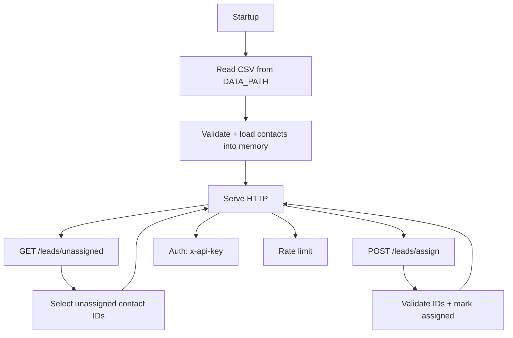

# lead distribution service

HTTP API for distributing leads from a CSV dataset. Loads contacts into memory
at startup and tracks assignments in-process.

Build and run:

```sh
cargo build --release
API_KEYS="key1,key2" DATA_PATH="./data/contacts.csv" ./target/release/one-lookup
```

Flow:



Configuration (env):

- HOST (default: 127.0.0.1)
- PORT (default: 5000)
- DATA_PATH (required)
- API_KEYS (required, comma-separated)
- RATE_LIMIT_PER_MINUTE (default: 60)

Endpoints (protected routes require `x-api-key`):

```txt
GET  /health
GET  /leads/unassigned?limit=10
POST /leads/assign            # body: {lead_ids: number[]}
GET  /stats
```

CSV format:

```csv
dni,name,phone_primary,phone_secondary,org_ruc,org_name
12345678,Juan Perez,987654321,912345678,20123456789,Acme Corp
```

`dni` and `name` are required. Other fields are optional.
