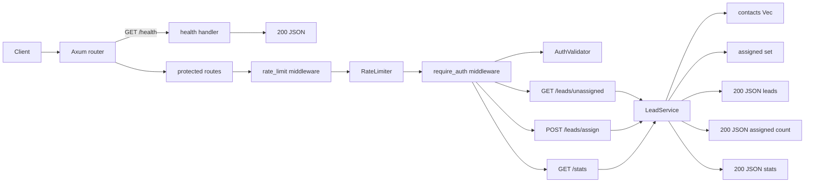

# one-lookup

Lead distribution API backed by a CSV dataset. Contacts are loaded into memory
at startup. Assignments are tracked in-process and reset on restart.

Run:

```sh
cargo build --release
API_KEYS="key1,key2" ./target/release/one-lookup
```

Request pipeline:



Endpoints:

```txt
GET  /health                         # public
GET  /leads/unassigned?limit=10      # x-api-key required
POST /leads/assign                   # x-api-key required, body: {lead_ids: number[]}
GET  /stats                          # x-api-key required
```

Configuration (env):

- HOST (default: 127.0.0.1)
- PORT (default: 5000)
- DATA_PATH (default: ./data/contacts.csv)
- API_KEYS (required, comma-separated)
- RATE_LIMIT_PER_MINUTE (default: 60)

CSV format:

```csv
dni,name,phone_primary,phone_secondary,org_ruc,org_name
```

`dni` and `name` are required. Other fields are optional. Rows with missing
required fields are skipped.

Code map:

- src/main.rs entrypoint (config load, service init, server start)
- src/config.rs env parsing and defaults
- src/api/mod.rs Axum router + layers (trace, compression)
- src/api/routes/health.rs /health
- src/api/routes/leads.rs /leads/\* and /stats (middleware order: rate -> auth)
- src/api/state.rs AppState (service + auth + limiter)
- src/middleware/auth.rs x-api-key validation (sha256)
- src/middleware/rate.rs per-key token bucket
- src/data.rs CSV loading and validation
- src/service/mod.rs lead selection + assignment tracking
- src/service/types.rs Contact/Lead/Stats + request types
- src/error.rs error type + HTTP mapping

Notes:

- Protected routes require `x-api-key` and are rate-limited.
- Lead IDs are stable for the lifetime of the process. `id` is the in-memory
  index.
- Assignment state is not persisted.
