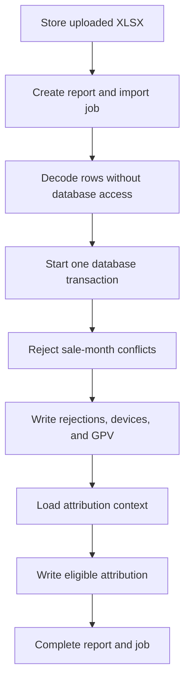

# Merchant GPV

The merchant GPV pipeline imports Culqi reports and makes device activity,
monthly GPV, attribution, and targets available to Culqi360 dashboards.

GPV is grouped by merchant RUC and realized month. A sale month identifies the
device cohort. A realized month is the sale month plus the report's cohort
offset. A cut identifies when Culqi produced a report snapshot.

## Import lifecycle

[`uploadMerchantReport`](../src/actions/dashboards/imports.ts) hashes the raw
file with SHA-256 and stores it before accepting the report. The unique
`content_sha256` value prevents the same file from creating another report or
job.

[`parseReport`](../src/server/merchant-stats/intake/parse-report.ts) decodes the
workbook without database access. The queue runner passes the decoded report to
[`applyReport`](../src/server/merchant-stats/apply/apply-report.ts), which
applies rejections, device data, GPV observations, and attribution in one
transaction.

## Data guarantees

The implementation enforces these guarantees:

- One content hash creates at most one report.
- A known sale identity keeps its original sale month.
- An older cut cannot replace a newer GPV observation for the same sale and
  cohort offset.
- Imported attribution cannot replace a manual resolution.
- Executives can read merchant GPV only for RUCs assigned to them.
- Manual attribution changes are written to the RUC timeline.

[`partitionBySaleMonth`](../src/server/merchant-stats/apply/sale-month-guard.ts)
rejects a row when its merchant, product, and serial identity already belongs to
another sale month.

[`upsertGpv`](../src/server/merchant-stats/apply/write-gpv.ts) compares `cut_at`
before replacing GPV and transaction counts. This cut guard applies to GPV
observations. Device metadata is refreshed by every accepted report.

## Monthly GPV

`merchant_sale_gpv.month_offset` stores the cohort offset. PostgreSQL generates
`realized_month` from the sale month and offset. The `merchant_monthly_gpv` view
groups those observations by RUC and realized month. These objects are defined
in the
[merchant statistics schema](../src/lib/db/schema/modules/merchant-stats.ts).

## Attribution

Attribution is calculated once for every RUC and realized month in an imported
batch. [`attributeMonth`](../src/server/merchant-stats/attribution/ladder.ts)
uses this order:

1. Conflicting serial evidence remains unattributed.
2. One serial owner produces exact attribution.
3. A qualifying RUC lead produces inferred attribution.
4. A lead created after any contributing sale is marked late.
5. Missing evidence remains unattributed.

An import may fill an unresolved attribution when new evidence becomes
available. It does not replace an existing seller or a manual resolution.

Managers resolve attribution through
[`resolveAttribution`](../src/actions/dashboards/attribution.ts). The action
updates the monthly attribution and appends a `merchant_attribution_resolved`
event for the `merchant_ruc` timeline.

## Targets

Targets are effective-dated by `(ruc, effective_from)`. Dashboard queries select
the latest target effective on or before the observed month through
[`target-as-of.ts`](../src/server/merchant-stats/read/target-as-of.ts).

Updating the same RUC and effective date replaces that target and changes
calculations for its effective period. Insert a later effective date when the
earlier period must remain unchanged.

Target changes run through the audited
[`setMerchantTarget`](../src/actions/dashboards/attribution.ts) action and
append a `merchant_target_set` event to the RUC timeline.

## Access control

| Permission            | Access                                                            |
| --------------------- | ----------------------------------------------------------------- |
| `dashboards:read`     | Team dashboards and the quality summary.                          |
| `dashboards:read:own` | GPV for RUCs assigned to the caller.                              |
| `dashboards:manage`   | Report uploads, attribution changes, targets, and quality queues. |

Executives receive `dashboards:read:own`, but not `dashboards:read` or
`dashboards:manage`. The canonical role assignments are in
[`rbac.ts`](../src/lib/auth/access/rbac.ts). RUC-level access is enforced by
[`getMerchantStatsForRuc`](../src/actions/dashboards/org-stats.ts).

## Storage and queue execution

Uploaded reports are stored as `gpv-reports/<sha256>.xlsx` under
`WEB_UPLOADS_ROOT`. `merchant_reports.storage_key` stores that relative path.

The report queue uses [`createJobQueue`](../src/lib/job-queue/job-queue.ts) and
claims only `import_gpv` records from `workflow_integration_jobs`. Record
imports use the same table with different job types, so the workers do not claim
each other's jobs.

The upload UI polls `getMerchantReportJob` every 1.5 seconds. It revalidates GPV
queries after the job completes. This flow does not use server-sent events.

## Database objects

All objects below are defined in
[`merchant-stats.ts`](../src/lib/db/schema/modules/merchant-stats.ts).

| Object                         | Key                       | Purpose                                                    |
| ------------------------------ | ------------------------- | ---------------------------------------------------------- |
| `merchant_reports`             | `id`                      | Report snapshots and their content hashes.                 |
| `merchant_report_rejections`   | `(report_id, row_number)` | Rejected source rows and their original JSON.              |
| `merchant_sales`               | `id`                      | Merchant devices, unique by merchant, product, and serial. |
| `merchant_sale_gpv`            | `(sale_id, month_offset)` | Device GPV by cohort offset.                               |
| `merchant_monthly_gpv`         | View                      | GPV grouped by RUC and realized month.                     |
| `merchant_monthly_attribution` | `(ruc, month)`            | Imported or manually resolved attribution.                 |
| `merchant_targets`             | `(ruc, effective_from)`   | Effective-dated targets.                                   |

`MerchantReportId` and `MerchantSaleId` are registered in
[`registry.ts`](../src/server/shared/ids/registry.ts). Tables with composite
keys do not use surrogate IDs.

## Maintenance and demo data

Schema changes require updates to
[`merchant-stats.ts`](../src/lib/db/schema/modules/merchant-stats.ts) and
[`merchant-stats.types.ts`](../src/lib/db/schema/modules/merchant-stats.types.ts).
Follow [Database development](database.md) to rebuild the disposable database.

Demo generation and persistence live under
[`src/lib/db/seeds/demo/merchant-stats/`](../src/lib/db/seeds/demo/merchant-stats/).
The seed imports two report cuts, creates effective-dated targets, and produces
examples for attribution and quality views.
