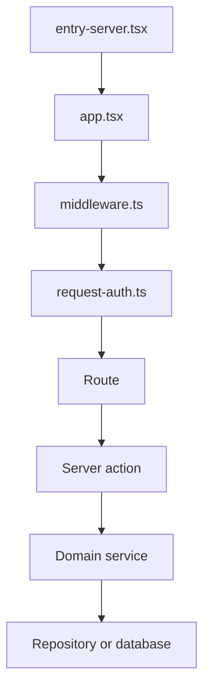

# Culqi360 web application

The web application serves the Culqi360 UI, API routes, and maintenance worker.
It stores application state in PostgreSQL and uses the engine for contact search
and candidate assignment.

## Request lifecycle



[`middleware.ts`](src/middleware.ts) adds request metadata, prepares the CSP
nonce and CSRF cookie, and delegates authentication to
[`request-auth.ts`](src/lib/auth/access/request-auth.ts). Public requests bypass
session checks. Authenticated requests store their session on `event.locals`.

Authenticated routes live under [`src/routes/(app)/`](src/routes/%28app%29/),
and public routes live under [`src/routes/(public)/`](src/routes/%28public%29/).
Routes call server functions in [`src/actions/`](src/actions/). Read and write
wrappers exposed to UI code live in [`src/lib/queries/`](src/lib/queries/) and
[`src/lib/mutations/`](src/lib/mutations/).

Domain services and repositories live under [`src/server/`](src/server/).
[`src/server/platform/action/`](src/server/platform/action/) runs actions with
authentication, parsing, auditing, and error handling. Runtime dependencies are
assembled by domain in
[`src/server/platform/container/`](src/server/platform/container/).

## Persistence

PostgreSQL stores application state. Database access starts in
[`client.ts`](src/lib/db/client.ts) and [`db.ts`](src/lib/db/db.ts). Schema
modules live under [`src/lib/db/schema/modules/`](src/lib/db/schema/modules/).

Culqi360 builds a new database from the current schema modules. It stores a hash
of that schema and stops startup when an existing database has a different hash.
Development databases are disposable; reset the database after changing a schema
module.

See [Database development](docs/database.md) for initialization, reset, and
schema-change commands.

## Background processing

Queue records are stored in PostgreSQL. The maintenance worker listens for
PostgreSQL notifications and checks the affected queues when notified. It also
checks every queue once per second, so a missed notification does not strand a
job. The worker entry point is
[`background-jobs.ts`](src/lib/background-jobs.ts), and the shared queue runner
is [`job-queue.ts`](src/lib/job-queue/job-queue.ts).

Browser updates use feature-specific transports:

- Record-import progress and event logs use server-sent events.
- GPV report imports poll their job status every 1.5 seconds.
- Queue execution does not depend on an active browser connection.

## Engine integration

The engine client contract lives in
[`src/server/shared/engine/`](src/server/shared/engine/), and the HTTP adapter
lives in [`src/server/adapters/engine/`](src/server/adapters/engine/). Direct
search is implemented under
[`src/server/search-workflow/`](src/server/search-workflow/). Candidate
assignment is implemented under
[`src/server/contact-assignments/`](src/server/contact-assignments/).

## Run the application

From the repository root:

```sh
bun run dev:infra:setup
bun run dev
```

The setup command is required once for a new checkout. Normal development uses
`bun run dev`, which starts PostgreSQL, the engine, the web server, and the
worker.

The root package also provides focused process commands:

- `bun run dev:infra`
- `bun run dev:web`
- `bun run dev:engine`
- `bun run dev:worker`

From `apps/web`, the common commands are:

```sh
bun run dev
bun run check
bun run test
bun run test:e2e
bun run build
```

Production entry points are `start`, `migrate:prod`, `provision:prod`, and
`worker:maintenance:prod` in [`package.json`](package.json). Deployment must
provide the environment instead of relying on a local env file.

## Diagnostics

Diagnostics cover SSR, hydration, and request tracing. They are separate from
audit and operational logs.

Server channels use `DEBUG_DIAGNOSTICS`. Browser channels use
`VITE_DEBUG_DIAGNOSTICS`. Filters use `DEBUG_DIAGNOSTICS_FILTER` and
`VITE_DEBUG_DIAGNOSTICS_FILTER`.

```sh
DEBUG_DIAGNOSTICS=ssr bun run dev
VITE_DEBUG_DIAGNOSTICS=hydration bun run dev
DEBUG_DIAGNOSTICS=requests bun run dev
DEBUG_DIAGNOSTICS=requests DEBUG_DIAGNOSTICS_REQUESTS=verbose bun run dev
DEBUG_DIAGNOSTICS=requests DEBUG_DIAGNOSTICS_REQUESTS_SLOW_MS=500 bun run dev
```

The available channels are `ssr`, `hydration`, and `requests`. Request tracing
includes document navigations, server functions, API routes, mutations, slow
responses, failures, and aborted requests. Verbose request diagnostics also
include asset traffic.

## Further reading

- [Web configuration](docs/configuration.md)
- [Database development](docs/database.md)
- [End-to-end testing](docs/e2e-testing.md)
- [Merchant GPV](docs/merchant-gpv.md)
- [User-facing terminology](docs/glossary.md)
- [Repository architecture](../../docs/architecture.md)
