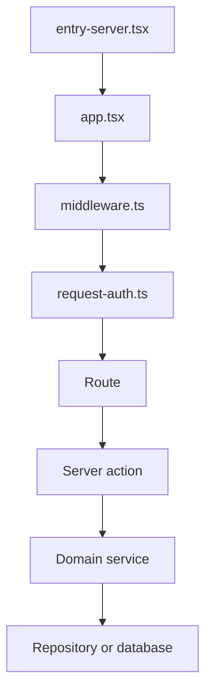

# Culqi360 web application

The web application serves the Culqi360 UI, API routes, and maintenance worker.
It stores application state in PostgreSQL and uses the engine for contact search
and candidate assignment.

## Request lifecycle



[`middleware.ts`](src/middleware.ts) adds request metadata, prepares the CSP
nonce and CSRF cookie, and delegates authentication to
[`request-auth.ts`](src/server/platform/http/request-auth.ts). Public requests
bypass session checks. Authenticated requests store their session on
`event.locals`.

Authenticated routes live under [`src/routes/(app)/`](src/routes/%28app%29/),
and public routes live under [`src/routes/(public)/`](src/routes/%28public%29/).
Routes and features call server functions in [`src/rpc/`](src/rpc/). Each RPC
module validates transport input and delegates to its product capability.

Domain services and repositories live under [`src/server/`](src/server/).
[`src/server/platform/action/`](src/server/platform/action/) runs actions with
authentication, parsing, auditing, and error handling. Runtime dependencies are
assembled by domain in
[`src/server/platform/container/`](src/server/platform/container/).

## Persistence

PostgreSQL stores application state. Database infrastructure lives under
[`src/server/platform/database/`](src/server/platform/database/). Schema modules
live under
[`src/server/platform/database/schema/modules/`](src/server/platform/database/schema/modules/).

See [Database development](docs/database.md).

## Background processing

The maintenance worker executes durable jobs stored in PostgreSQL. PostgreSQL
`LISTEN`/`NOTIFY` wakes the worker when work is available, and a one-second poll
recovers missed notifications.

Browser updates use the realtime pipeline in
[`src/server/realtime/`](src/server/realtime/). See
[Realtime](docs/realtime.md).

The worker entry point is
[`maintenance-runner.ts`](src/workers/maintenance-runner.ts). Queue
infrastructure lives in
[`src/server/platform/jobs/`](src/server/platform/jobs/).

## Engine integration

The engine client contract and HTTP adapter live in
[`src/server/integrations/engine/`](src/server/integrations/engine/). Direct
search is implemented under
[`src/server/search-workflow/`](src/server/search-workflow/). Candidate
assignment is implemented under
[`src/server/contact-assignments/`](src/server/contact-assignments/).

## Run the application

From the repository root:

```sh
bun run dev:infra:setup
bun run dev
```

The setup command is required once for a new checkout. `bun run dev` starts the
web application, maintenance worker, PostgreSQL, and the engine.

See the repository README for additional development commands.

## Further reading

- [Web configuration](docs/configuration.md)
- [Database development](docs/database.md)
- [Realtime](docs/realtime.md)
- [Diagnostics](docs/diagnostics.md)
- [End-to-end testing](docs/e2e-testing.md)
- [Merchant GPV](docs/merchant-gpv.md)
- [User-facing terminology](docs/glossary.md)
- [Repository architecture](../../docs/architecture.md)
