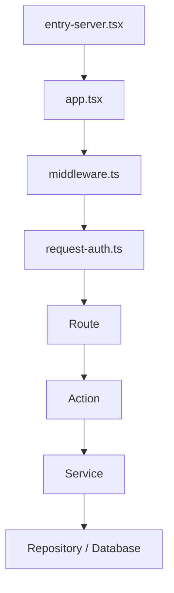

# The web

The web application serves the CRM UI, API routes, and the background
maintenance worker.

Application state lives in PostgreSQL (set by `WEB_DB_URL` in `.env`).
Database schema modules live under [`src/lib/db/schema/`](src/lib/db/schema/),
and migrations run through
[`src/lib/db/migrate-cli.ts`](src/lib/db/migrate-cli.ts).

Background work uses the PostgreSQL-backed job queue in
[`src/lib/job-queue/`](src/lib/job-queue/). Jobs are coordinated with
`LISTEN`/`NOTIFY` and exposed to clients over server-sent events via
[`src/lib/realtime/event-source-stream.ts`](src/lib/realtime/event-source-stream.ts).

Most requests follow the same path:



`middleware.ts` sets request metadata, prepares the CSP nonce and CSRF cookie,
and delegates authentication to
[`request-auth.ts`](src/lib/auth/access/request-auth.ts). That auth layer
handles public paths separately, validates the session cookie, and redirects
for login or onboarding; authenticated requests store their session on
`event.locals`.

Authenticated pages live under [`src/routes/(app)/`](src/routes/%28app%29/).
Public pages live under [`src/routes/(public)/`](src/routes/%28public%29/).
Server functions live under [`src/actions/`](src/actions/): read wrappers in
[`src/lib/queries/`](src/lib/queries/), write wrappers in
[`src/lib/mutations/`](src/lib/mutations/). Domain services and repositories
live under [`src/server/`](src/server/); action runtime wiring lives in
[`src/server/platform/action/`](src/server/platform/action/), and dependency
assembly lives in
[`src/server/platform/container/`](src/server/platform/container/) (one
`*-runtime.ts` per domain). Database access starts in
[`src/lib/db/client.ts`](src/lib/db/client.ts) and
[`src/lib/db/db.ts`](src/lib/db/db.ts). Extension session and event APIs live
under [`src/routes/api/extension/`](src/routes/api/extension/).

Search is the main external dependency. The engine client interface lives in
[`src/server/shared/engine/`](src/server/shared/engine/), the HTTP adapter in
[`src/server/adapters/engine/`](src/server/adapters/engine/), direct search in
[`src/server/search-workflow/`](src/server/search-workflow/), and contact
assignment in
[`src/server/contact-assignments/`](src/server/contact-assignments/).

## Configuration

Configuration comes from environment files selected by the caller.

| Group             | Variable                                     |
| ----------------- | -------------------------------------------- |
| Authentication    | `SESSION_SECRET`                             |
| Authentication    | `TOTP_ENCRYPTION_KEY`                        |
| Authentication    | `RECOVERY_CODE_PEPPER`                       |
| Authentication    | `INSTALLATION_PASSWORD`                      |
| Authentication    | `ENGINE_HMAC_KEY_ID`                         |
| Authentication    | `ENGINE_HMAC_SECRET`                         |
| Engine            | `ENGINE_CONNECT_MODE`                        |
| Engine            | `ENGINE_URL`                                 |
| Engine            | `ENGINE_TIMEOUT_MS`                          |
| Storage and proxy | `WEB_DB_URL`                                 |
| Storage and proxy | `WEB_UPLOADS_ROOT`                           |
| Storage and proxy | `TRUSTED_PROXY`                              |
| Storage and proxy | `APP_PUBLIC_ORIGIN`                          |
| WebAuthn          | `WEBAUTHN_RP_ID`                             |
| WebAuthn          | `WEBAUTHN_ORIGIN`                            |
| Extension / OAuth | `EXTENSION_EXPECTED_ORIGIN`                  |
| Extension / OAuth | `EXTENSION_HANDOFF_PRIVATE_KEY_PKCS8_BASE64` |
| Extension / OAuth | `EXTENSION_HANDOFF_PUBLIC_KEY_SPKI_BASE64`   |
| Extension / OAuth | `GOOGLE_CLIENT_ID`                           |
| Extension / OAuth | `GOOGLE_CLIENT_SECRET`                       |
| Extension / OAuth | `GOOGLE_REDIRECT_URI`                        |
| Notifications     | `NOTIFICATION_ROUTES`                        |
| Notifications     | `RESEND_API_KEY`                             |
| Notifications     | `EMAIL_FROM`                                 |
| Notifications     | `KAPSO_API_KEY`                              |
| Notifications     | `KAPSO_WHATSAPP_PHONE_NUMBER_ID`             |
| Notifications     | `KAPSO_META_GRAPH_VERSION`                   |
| Notifications     | `WHATSAPP_CLOUD_ACCESS_TOKEN`                |
| Notifications     | `WHATSAPP_CLOUD_PHONE_NUMBER_ID`             |
| Notifications     | `WHATSAPP_CLOUD_GRAPH_VERSION`               |
| Notifications     | `WHATSAPP_WEBHOOK_VERIFY_TOKEN`              |
| Notifications     | `KAPSO_WEBHOOK_SECRET`                       |
| Observability     | `VITE_SENTRY_DSN`                            |

The engine client defaults to `ENGINE_CONNECT_MODE=local` and
`ENGINE_URL=http://127.0.0.1:3001`. Local mode requires a loopback `http`
endpoint so the engine stays private to the host; remote mode requires an
`https` endpoint. The WebAuthn relying party is derived per request from the
public origin (`requestContext.publicOrigin`). Definitions live in
[`src/lib/env.ts`](src/lib/env.ts), [`src/lib/config.ts`](src/lib/config.ts),
and [`vite.config.ts`](vite.config.ts).

## Running

From the repository root:

```sh
bun run dev:infra:setup # one-time: initialize the local PostgreSQL data dir
bun run dev
bun run dev:web
bun run dev:worker
```

`bun run dev` starts PostgreSQL, the engine, the web server, and the worker.
The web process waits for PostgreSQL, runs migrations, provisions an empty
installation, seeds development data, and starts Vite. `bun run dev:worker`
starts only the maintenance worker.

From `apps/web/`:

```sh
bun run dev
bun run migrate
bun run seed
bun run build
bun run check
bun run test
bun run test:unit
bun run test:contract
bun run test:integration
bun run test:journey
bun run test:perf
bun run worker:maintenance
bun --env-file=../../.env.production run start
bun --env-file=../../.env.production run migrate:prod
bun --env-file=../../.env.production run provision:prod
bun --env-file=../../.env.production run worker:maintenance:prod
```

Local scripts choose their default env file automatically. Production
entrypoints stay explicit through `start`, `migrate:prod`, `provision:prod`,
and `worker:maintenance:prod`.

End-to-end tests run against a built server and a real Postgres database, with
per-worker database isolation and cookie-based auth; see
[`docs/e2e-testing.md`](docs/e2e-testing.md).

## Diagnostics

Use diagnostics for SSR, hydration, and request debugging. These traces are
opt-in and separate from audit or operational logs. Keep product code
instrumentation minimal; prefer stable boundaries and generic wrappers over
feature-level render tracing.

Server-side channels use `DEBUG_DIAGNOSTICS`. Client-side channels use
`VITE_DEBUG_DIAGNOSTICS`. Narrow output with `DEBUG_DIAGNOSTICS_FILTER` or
`VITE_DEBUG_DIAGNOSTICS_FILTER`.

```sh
DEBUG_DIAGNOSTICS=ssr bun run dev
VITE_DEBUG_DIAGNOSTICS=hydration bun run dev
DEBUG_DIAGNOSTICS=requests bun run dev
DEBUG_DIAGNOSTICS=requests DEBUG_DIAGNOSTICS_REQUESTS=verbose bun run dev
DEBUG_DIAGNOSTICS=requests DEBUG_DIAGNOSTICS_REQUESTS_SLOW_MS=500 bun run dev
DEBUG_DIAGNOSTICS=ssr DEBUG_DIAGNOSTICS_FILTER=app-layout,auth-session-action bun run dev
```

Available channels:

- `ssr`: shared render boundaries and a small set of server-side wrappers
- `hydration`: client mount, boundary failures, window errors, unhandled
  rejections
- `requests`: Vite dev-server request tracing

Request tracing defaults to useful traffic only: document navigations,
`/_server`, `/api/*`, non-`GET` requests, slow responses, failures, and
aborted requests. Use `DEBUG_DIAGNOSTICS_REQUESTS=verbose` only when you need
asset-level request noise.

## First reads

The engine HTTP and projection contracts live under
[`../../contracts/engine/`](../../contracts/engine/). Generated bindings are
in
[`record-contract.ts`](src/server/shared/engine/record-contract.ts),
[`doc-projection-contract.ts`](src/server/shared/engine/doc-projection-contract.ts),
and
[`company-projection-contract.ts`](src/server/shared/engine/company-projection-contract.ts).

If you're new to the codebase, start here:

- Request and session flow: [`src/middleware.ts`](src/middleware.ts),
  [`src/lib/auth/access/request-auth.ts`](src/lib/auth/access/request-auth.ts)
- Action execution: [`src/actions/auth/login/`](src/actions/auth/login/),
  [`src/server/platform/action/`](src/server/platform/action/)
- Dependency assembly:
  [`src/server/platform/container/`](src/server/platform/container/)
- Engine-backed search and candidate assignment:
  [`src/server/shared/engine/client.ts`](src/server/shared/engine/client.ts),
  [`src/server/adapters/engine/client.ts`](src/server/adapters/engine/client.ts),
  [`src/server/search-workflow/run-search.ts`](src/server/search-workflow/run-search.ts),
  [`src/server/contact-assignments/application/assign-contacts.ts`](src/server/contact-assignments/application/assign-contacts.ts)

For the end-to-end test suite, see
[`docs/e2e-testing.md`](docs/e2e-testing.md). For the merchant GPV import
pipeline, see [`docs/merchant-gpv-pipeline.md`](docs/merchant-gpv-pipeline.md).
