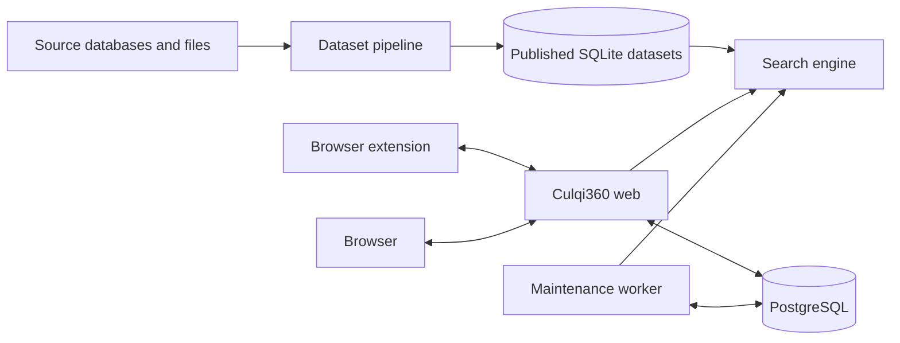

# System architecture

Culqi360 runs as a web application, a maintenance worker, a search engine, and a
browser extension. PostgreSQL stores application state and the worker queue. The
search engine reads SQLite datasets built by the source-data pipeline.

## Web application

The web application serves the Culqi360 UI and API routes. It stores sessions,
organizations, workflow state, sales data, notification state, and reporting
data in PostgreSQL. Search and candidate assignment are delegated to the engine.

The maintenance worker uses the same application services and PostgreSQL
database as the web application. PostgreSQL `LISTEN`/`NOTIFY` wakes the worker
when work is available, and a one-second poll recovers missed notifications.

Realtime browser delivery is separate from queue execution. Record-import
progress, GPV report imports, and event logs all use the same server-sent event
pipeline, backed by one PostgreSQL `LISTEN` connection per process. Each
connection reads the subscriber's current state in the same query that
authorizes it, so reconnects lose no events.

See the [web application guide](../apps/web/readme.md) for request handling,
persistence, and background processing.

## Search data

The pipeline validates source files and publishes SQLite datasets. The engine
serves those datasets over signed HTTP endpoints for search, candidate
selection, record imports, and health checks.

Engine HTTP and projection contracts live in
[`contracts/engine/`](../contracts/engine/). Run `bun run check:contracts` to
check generated bindings. Run `bun run check:search-contract` to check search
compatibility.

The implementation entry points are:

- Pipeline orchestration: [`pipeline.rs`](../crates/pipeline/src/pipeline.rs)
- Engine runtime: [`runtime.rs`](../crates/engine/src/runtime.rs)
- Search API: [`api.rs`](../crates/search/src/api.rs)
- Web engine adapter:
  [`client.ts`](../apps/web/src/server/adapters/engine/client.ts)

## Browser extension

The extension receives signed handoff messages and synchronizes call state
through extension API routes. Start with
[`runtime.ts`](../apps/extension/src/background/runtime.ts) and
[`external-auth.ts`](../apps/extension/src/services/external-auth.ts).
