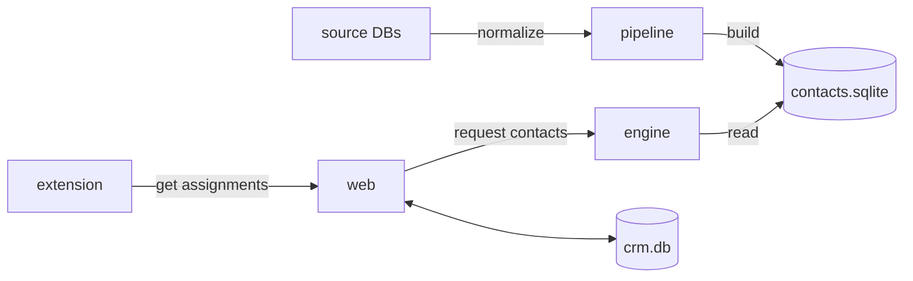

<h1 align="center">onechannel.pe</h1>

<p align="center">A CRM built for managing contacts, routing leads, and logging calls.</p>

<p align="center">
  <a href="https://github.com/onechannelpe/crm/actions/workflows/web.yml"></a>
  <a href="https://github.com/onechannelpe/crm/actions/workflows/engine.yml"></a>
  <a href="https://github.com/onechannelpe/crm/actions/workflows/pipeline.yml"></a>
  <a href="https://github.com/onechannelpe/crm/actions/workflows/extension.yml"></a>
  <a href="https://github.com/onechannelpe/crm/actions/workflows/contracts.yml"></a>
</p>

## How it's built

Search is the core of the CRM — agents look up contacts by DNI, RUC, phone, or name constantly, and it has to be fast. Rather than querying a live database on every keystroke, we pre-build a SQLite snapshot offline and serve it from a dedicated read-only Rust process. The web app never touches that data directly; it sends signed HTTP requests to the engine and gets rows back.

That separation is the key architectural decision. The **pipeline** owns data quality: it ingests source files, normalizes them against shared contracts, runs a quality gate, and atomically promotes a new snapshot when it passes. The **engine** is intentionally dumb — it validates the request signature, checks the rate limit, and executes the query. The **web app** handles everything else: auth, lead assignment, CRM state, notifications. The **extension** runs in the browser during calls and syncs back to the web app over a signed handoff protocol.



The contract between web and engine is [`contracts/engine-api.json`](contracts/engine-api.json). If you change it, run `bun run generate` to regenerate web bindings and `bun run check:contract` to validate them. Search projection and search contracts have their own checks: `bun run check:projection-contract` and `bun run check:search-contract`.

## Apps

| | |
|---|---|
| [`apps/web/`](apps/web/) | SolidStart app — CRM UI, auth, lead assignment, extension APIs, maintenance worker |
| [`apps/engine/`](apps/engine/) | Rust/Axum search API over the published SQLite snapshot |
| [`apps/pipeline/`](apps/pipeline/) | Rust pipeline that builds, validates, and promotes the SQLite dataset |
| [`apps/extension/`](apps/extension/) | Browser extension for call state tracking and recording sync |

## Local setup

```sh
mise install
bun install
cp .env.example .env
bun run generate
bun run dev
```

`bun run dev` starts the engine and web app together. The pipeline runs separately — see [`apps/pipeline/`](apps/pipeline/) when you need to refresh the search dataset.
