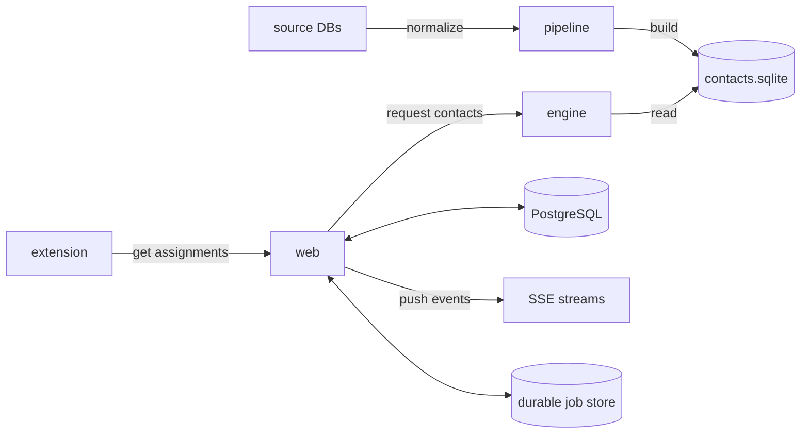

<h1 align="center">onechannel.pe</h1>

<p align="center">
  <a href="apps/web/readme.md">web</a>
  ·
  <a href="crates/engine/readme.md">engine</a>
  ·
  <a href="crates/pipeline/readme.md">pipeline</a>
  ·
  <a href="apps/extension/readme.md">extension</a>
</p>

<p align="center">
  <a href="https://github.com/onechannelpe/crm/actions/workflows/web.yml"></a>
  <a href="https://github.com/onechannelpe/crm/actions/workflows/engine.yml"></a>
  <a href="https://github.com/onechannelpe/crm/actions/workflows/pipeline.yml"></a>
  <a href="https://github.com/onechannelpe/crm/actions/workflows/extension.yml"></a>
  <a href="https://github.com/onechannelpe/crm/actions/workflows/contracts.yml"></a>
</p>

This monorepo is built around a shared contact dataset (`contacts.sqlite`).



The pipeline builds a SQLite snapshot from source files and shared contracts.
The engine serves that snapshot through signed HTTP endpoints for search, record
candidates, record imports, and health checks. The web application serves the CRM
UI, keeps application state in PostgreSQL (`WEB_DB_URL`), and calls the engine
through its shared engine adapter. Background work runs through a durable job
store that listens to PostgreSQL `LISTEN`/`NOTIFY` and exposes results over
server-sent events. The browser extension receives signed handoff messages from
the web application and syncs call state through extension API routes.

The engine HTTP and projection contracts live under
[`contracts/engine/`](contracts/engine/). Generated bindings in the web,
`search`, and `leads` crates are derived from those files. If a contract changes,
regenerate bindings with `bun run generate`. Validate generated artifacts with
`bun run check:contracts` and search compatibility with
`bun run check:search-contract`.

## Applications

- [`apps/web/`](apps/web/)
  The main application. It serves the UI, API routes, and the maintenance worker.
- [`crates/engine/`](crates/engine/)
  The search service. It verifies signed requests and queries the published SQLite dataset.
- [`crates/pipeline/`](crates/pipeline/)
  The dataset pipeline. It validates source files, builds the staged dataset, and promotes the SQLite snapshot used by the engine.
- [`apps/extension/`](apps/extension/)
  The browser extension for call handling. It receives assignment handoff and syncs call state back to the web application.

## Get started

Install the toolchain, install dependencies, create `.env`, generate contract bindings, and start the web application and engine:

```sh
mise install # install mise if you don't have it yet: curl https://mise.run | sh
bun install
cp .env.example .env
bun run generate
bun run dev:infra:setup # one-time: initialize the local PostgreSQL data dir
bun run dev
```

`bun run dev` starts the local PostgreSQL, engine, web, and worker. The web
script waits for PostgreSQL to accept connections, runs migrations, and seeds
development fixtures before Vite starts. `bun run dev:web`, `bun run dev:engine`,
`bun run dev:worker`, and `bun run dev:infra` start each process individually.

Containerized deployments use `compose.app.yml` and `compose.engine.yml` with
`ops/deployment/app.env.example` and `ops/deployment/engine.env.example` as the
required environment file templates.

## Read this first

- Web request and auth flow: [`apps/web/src/middleware.ts`](apps/web/src/middleware.ts), [`apps/web/src/lib/auth/access/request-auth.ts`](apps/web/src/lib/auth/access/request-auth.ts)
- Web service wiring: [`apps/web/src/server/platform/action/context.ts`](apps/web/src/server/platform/action/context.ts), [`apps/web/src/server/platform/container/*-runtime.ts`](apps/web/src/server/platform/container/)
- Web engine client and adapter: [`apps/web/src/server/shared/engine/client.ts`](apps/web/src/server/shared/engine/client.ts), [`apps/web/src/server/adapters/engine/client.ts`](apps/web/src/server/adapters/engine/client.ts)
- Durable job runtime and SSE streams: [`apps/web/src/lib/job-queue/job-queue.ts`](apps/web/src/lib/job-queue/job-queue.ts), [`apps/web/src/lib/db/notify.ts`](apps/web/src/lib/db/notify.ts), [`apps/web/src/lib/realtime/event-source-stream.ts`](apps/web/src/lib/realtime/event-source-stream.ts)
- Notification pipeline (intent, expansion, dispatch, delivery): [`apps/web/src/server/notifications/intent/`](apps/web/src/server/notifications/intent/), [`apps/web/src/server/notifications/expansion/`](apps/web/src/server/notifications/expansion/), [`apps/web/src/server/notifications/dispatch/`](apps/web/src/server/notifications/dispatch/)
- Kapso webhook intake: [`apps/web/src/server/integrations/kapso/webhooks/receive-webhook.ts`](apps/web/src/server/integrations/kapso/webhooks/receive-webhook.ts)
- Engine startup and request handling: [`crates/engine/src/runtime.rs`](crates/engine/src/runtime.rs), [`crates/search/src/api.rs`](crates/search/src/api.rs), [`crates/leads/src/api.rs`](crates/leads/src/api.rs)
- Pipeline orchestration: [`crates/pipeline/src/pipeline.rs`](crates/pipeline/src/pipeline.rs), [`crates/pipeline/src/cli.rs`](crates/pipeline/src/cli.rs)
- Extension runtime and handoff flow: [`apps/extension/src/background/runtime.ts`](apps/extension/src/background/runtime.ts), [`apps/extension/src/services/external-auth.ts`](apps/extension/src/services/external-auth.ts)

## Validation

```sh
bun run check             # all-in-one: rust + contracts + web types + lint + format
bun run check:rust        # cargo xtask-check, format, clippy
bun run check:contracts   # verify generated contract artifacts
bun run check:search-contract
bun run check:web         # oxlint + tsc on apps/web
bun run check:lint        # oxlint across web + packages + tools
bun run check:format      # oxfmt check across ts and rust
bun --cwd apps/web test                 # vitest: unit, contract, integration, journey
bun run test:engine                     # cargo test -p engine
bun run test:extension:integration      # apps/extension playwright tests
```
